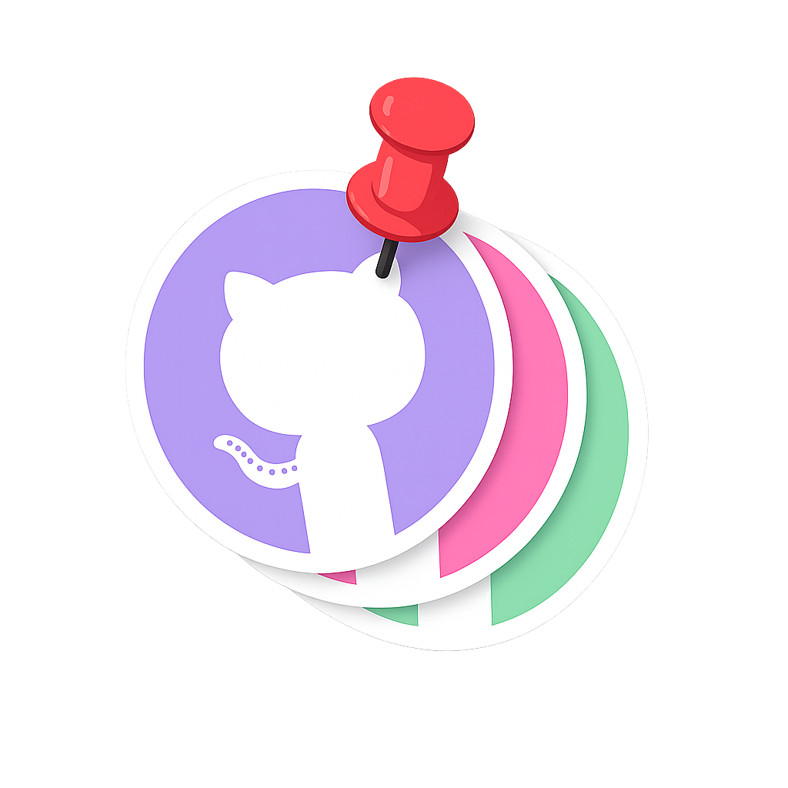
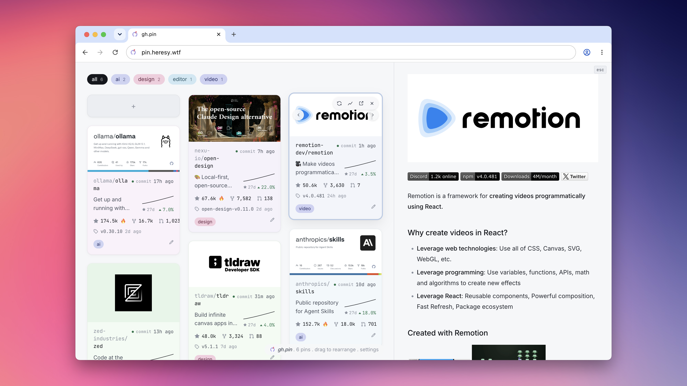

# gh.pin

<p align="center"></p>

> A personal wall for the GitHub repos you actually care about, with snapshots so you can watch them grow.

<p align="center">
  
  
  
</p>

<p align="center"><a href="https://pin.heresy.wtf"></a></p>

Public instance here: [pin.heresy.wtf](https://pin.heresy.wtf)

## What it does

- **Pin repos** by pasting a GitHub URL or `owner/repo` anywhere on the page
- **Track metrics over time** with periodic snapshots: stars, releases, and activity
- **Read every README** in one place, no tab-hopping
- **Private by design**: everything lives in your browser, no backend, no shared state, no auth
- **Installable** as a PWA

Pins, snapshots, and your optional GitHub token live entirely in your browser's IndexedDB. One deployed copy works for any number of people, each with their own independent wall.

## Use it

Open the hosted instance and paste a GitHub URL (or `owner/repo`) anywhere on the page to store it as a tile. Installable as a PWA from the browser's install prompt.

Without a token the GitHub API allows 60 requests/hour, enough for a handful of pins. Add a fine-grained personal access token (no scopes needed for public repos) in settings to raise that to 5000/hour. The token never leaves your browser.

## Deploy your own

[](https://deploy.workers.cloudflare.com/?url=https://github.com/segudev/gh.pin)

Or manually with Wrangler:

```sh
npm install
npm run build
npm run deploy
```

Any static host works (GitHub Pages, Netlify, ...): serve the `dist/` directory from the site root.

## Develop

```sh
npm install
npm run dev
```

Vite + vanilla TypeScript, no framework. State and rendering live in `src/app.ts`, `src/state.ts`, and `src/render.ts`; storage is Dexie (IndexedDB) in `src/db.ts`; the GitHub REST client is `src/github.ts`.
